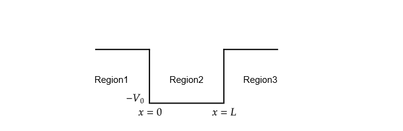

# Pole structures to one-dimensional potential well
在散射过程中，当入射粒子提供合适的能量 $E_0$ 时，能够被靶粒子俘获，形成短暂的束缚态，此即为共振。对应的粒子的能量大于0。除此之外，还可能存在束缚态，对应的粒子能量小于零。在本文中，小编以一维方势阱为例，来讨论散射过程中的共振与束缚态。


势阱的情况如图所示：



三个区域对应的薛定谔方程的解为：

| Region | Soluation                       |
|--------|------------------------------------|
| 1      | $\psi_1 = e^{ik_1 x}+Ae^{-ik_1 x}$ |
| 2      | $\psi_2 = Be^{ik_2x}+Ce^{-ik_2x}$  |
| 3      | $\psi_3 = De^{-ik_1x}+Fe^{ik_1x}$  |

在式子中，
$k_1=\sqrt{2mE}/\hbar, k_2=\sqrt{2m(E+V_0)}/\hbar$
。在散射过程中，我们比较关心的时描述散射过程的 $S$ 矩阵。它的定义为：

$$
    |\psi_{\mathrm{out}}\rangle = \hat{S} |\psi_{\mathrm{in}}\rangle
$$

对于方势阱的情况，对应的 $|\psi_{\mathrm{in}}\rangle$ 和 $|\psi_{\mathrm{out}}\rangle$ 分别为

$$
\begin{aligned}
    |\psi_{\mathrm{in}}\rangle &= e^{ik_{1}x} + De^{-ik_{1}x} \\
    |\psi_{\mathrm{out}}\rangle &= Ae^{-ik_{1}x} + Fe^{ik_{1}x} 
\end{aligned}
$$

如果我们把 $e^{ikx}$ 记为道1， $e^{-ikx}$ 为道2。$S$矩阵的矩阵元可写为：

$$
 S = \begin{bmatrix}
        t & r\\
        r' & t'
\end{bmatrix}
$$

$t(r)$ 是跃迁振幅（反射振幅）。
利用一维势阱中的边界条件，我们可以给出

$$
    t \propto \frac{1}{\cos(k_2L)-\frac{i}{2}\left(\frac{k_2}{k_1}+\frac{k_1}{k_2}\right)\sin(k_2L)}
$$

$|t|^2$ 则为跃迁的概率。通过 $t$ 的极点，也就是 $1/t$ 分母为零的点，我们可以确定束缚态或者共振态能量的位置。下面我们通过一个案例来分析他们。设定以下参数的值：

```julia
const me = 9.1094e-31 # Unit: kg
const L = 8e-10 # Unit: m
const hbar = 1.0546e-34 # Unit: Js
#const V0 = 20 # Unit: eV
const q = 1.602e-19; # Unit: J
```

我们先来确定束缚态能量的位置。束缚态的能量 $E<0$ ，所以我们令 $E<0$ ，看看 $1/T$ 如何变化。如图所示,是 $E\in(20, 0)$ 下 $1/T$ 的曲线。


从图可以看出，一共有6个极点。稍后我们将确定这六个极点的具体位置。再来看共振态的情况。对于共振的情况，能量 $E$ 将带有一个虚部，实部则为一个正数。虚部的意义我们将在后面说明。另外， $1/t$ 将不再是实数。我们以 $|t|$ 为 $z$ 轴，   $x,y$ 为能量的实部和虚部，来看$T$变化情况。结果如图所示：


从图可以看出，共有7个共振态。通过数值分析，我们给出这些态对应的能量值。最后的结果放置在表格中：

| Pole to bound state | Pole to resonance |
|:-------------------:|:-----------------:|
| -3.619              | $0.66-0.943i$     |
| -8.374              | $8.169-3.19i$     |
| -12.471             | $16.862-4.945i$   |
| -15.734             | $26.738-6.667i$   |
| -18.095             | $37.795-8.417i$   |
| -19.523             | $50.034-10.21i$   |
| $\cdots$           | $63.453-12.051i$   |

散射理论指出，复 $k$ 平面上正虚轴的极点，对应束缚能级，而共振能级则出现在 $k$ 平面中。极点$k$值的虚部将决定了共振能级的宽度。将上述极点绘制在 $k$ 平面中，将清楚看到这一点。具体结果为：


以上是从散射理论的角度来确定系统的束缚能和共振。

最后，我们来看 $|t|^2$ 的变化情况。结果我们看到，只有当 $E$ 的能量合适的时候，才会出现共振。


